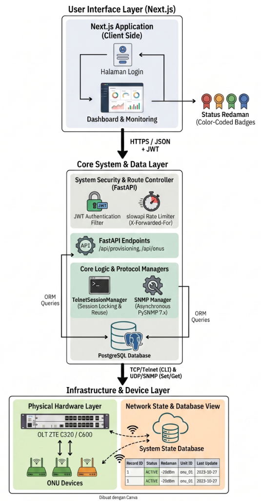

# ⚡ OptiProv (OLT-WEB)

<p align="center">
  
  
  
  
  
</p>

---

## 🌟 Overview

**OptiProv (OLT-WEB)** is a modern, high-performance web dashboard designed for network administrators and ISP operators to manage and monitor **ZTE GPON OLT** (Optical Line Terminal) hardware. Built with a robust **Next.js frontend** and an asynchronous **FastAPI backend**, OptiProv simplifies network provisioning, optical power auditing, and telemetry diagnostics into an intuitive, visually rich interface.

<div align="center">
<pre>
   ____        _   _ ____                 
  / __ \____  / /_(_) __ \_________ _   __
 / / / / __ \/ __/ / /_/ / ___/ __ \ | / /
/ /_/ / /_/ / /_/ / ____/ /  / /_/ / |/ / 
\____/ .___/\__/_/_/   /_/   \____/|___/  
    /_/                                   
   ZTE OLT Provisioning & Telemetry Hub
</pre>
</div>

---

## 🎯 Key Features

### 📡 Multi-Instance OLT Isolation
Deploy separate backend instances targeting different OLT profiles (`c600`, `c320`, etc.) using the `SELECTED_OLT_ID` environment variable override, running off a single PostgreSQL database without collisions.

### 🛡️ Live Telemetry & QC Sync
Real-time SNMP GET fetches optical Rx/Tx power and temperature directly from the fiber lines. Includes dynamic scaling and widening filters for degraded link diagnosis. Offline/LOS units automatically yield to prevent CPU flooding.

### ⚡ Non-Blocking Async Architecture
Synchronous Telnet connection tasks and command execution are offloaded to Python worker threads (`asyncio.to_thread`), preventing dashboard locks and event loop blocking.

### 🔄 Sequential SNMP Throttle
Replaced parallel bulk walks with a sequential walk pattern incorporating a breathing delay. This prevents overloading low-end OLT agents and eliminates transaction timeouts.

### 🧙‍♂️ Interactive Provisioning Wizard
Provision new ONUs through a guided 3-step setup:
1.  **Hardware & TCONT:** Allocate bandwidth profiles, VLAN IDs, and service ports.
2.  **Service Config:** Configure WAN IP modes, PPPoE credentials, and routing hosts.
3.  **Wi-Fi Config:** Modify SSIDs, maximum client limits, and security keys.

---

## 🏗️ System Architecture

<p align="center">
  
</p>

---

## 🛠️ Tech Stack

*   **Frontend:** Next.js (React), Tailwind CSS, Lucide Icons, Framer Motion.
*   **Backend:** FastAPI (Python), SQLAlchemy, Uvicorn, Asyncio.
*   **Database:** PostgreSQL 15.
*   **Hardware Protocol:** SNMP v2c (`pysnmp` 7.x), Telnet.

---

## 🚀 Getting Started

### Prerequisites
*   Docker & Docker Compose (v2.x)
*   Python 3.11+ (if running locally)

### Quick Start with Docker
Clone this repository and launch the multi-instance environment:
```bash
# Clone the repository
git clone https://github.com/UsernameGitHubAnda/OLT-WEB.git
cd OLT-WEB

# Run the entire stack in the background
docker compose up -d --build
```

---

## ✍️ Authors & Provenance

*   **Lead Developer & System Architect:** Hugo Purohita
*   **Project Origin:** Academic assignment and professional showcase portfolio.
*   **Verified Ownership:** Complete incremental commit history is preserved within the Git version log.
