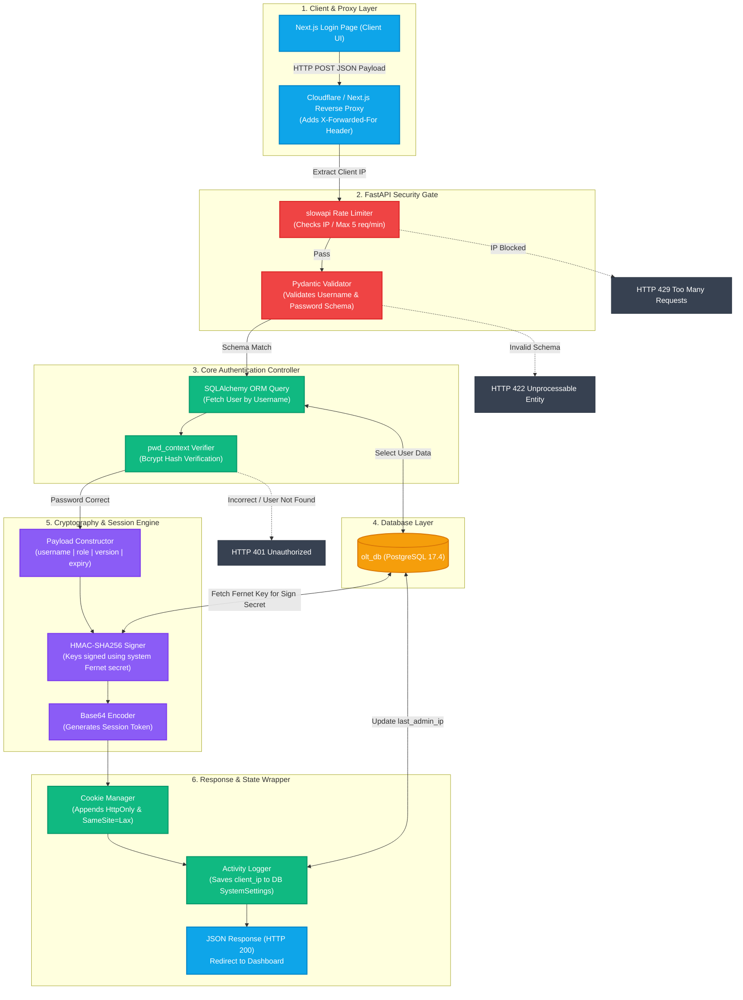

# 📊 MEKANISME & DIAGRAM BLOK AUTENTIKASI LOGIN (OPTIPROV)

Dokumen ini menjelaskan arsitektur blok dan langkah-langkah keamanan (security flow) yang berjalan di backend FastAPI pada saat proses autentikasi (login) pengguna di sistem **OptiProv**.

---

## 1. Diagram Blok Alur Autentikasi

Berikut adalah diagram blok yang menggambarkan lapisan fungsional (*decoupled system*) dan titik filter keamanan (*security gates*) sejak request dikirim oleh Next.js Client hingga token berhasil diterbitkan.

---

## 2. Penjelasan Rinci Alur Keamanan & Backend

Proses autentikasi berjalan secara sekuensial melewati 6 lapisan utama berikut:

### Lapisan 1: Client & Proxy Layer
1. Pengguna memasukkan `username` dan `password` pada form login Next.js.
2. Request dikirimkan melalui metode `HTTP POST` ke endpoint `/api/auth/login`.
3. Request melewati **Reverse Proxy** (Cloudflare / Next.js Rewrite). Proxy menambahkan IP publik asli pengguna ke dalam HTTP Header `X-Forwarded-For`.

### Lapisan 2: FastAPI Security Gate (Filtering)
1. **slowapi Rate Limiter:** Sistem mengekstrak IP asli menggunakan fungsi `get_client_ip(request)` untuk menghindari pemblokiran IP proxy internal. Jika IP yang bersangkutan melakukan percobaan login $\ge 5$ kali dalam 1 menit, request langsung ditolak dengan status **HTTP 429 Too Many Requests**.
2. **Pydantic Validator:** Validasi struktur JSON berdasarkan skema `LoginRequest`. Jika struktur data tidak sesuai (misal parameter `password` kosong atau tipe data tidak valid), FastAPI mengembalikan respons **HTTP 422 Unprocessable Entity** secara otomatis tanpa membebani database.

### Lapisan 3 & 4: Core Authentication & Database Layer
1. **User Query:** Menggunakan sesi SQLAlchemy ORM untuk mengambil data `User` dari database PostgreSQL berdasarkan `username` yang dikirim.
2. **Bcrypt Verifier:** Backend membandingkan password teks biasa dengan hash password yang tersimpan di database menggunakan pustaka `passlib` dengan algoritma **Bcrypt** (`verify_password`).
   * *Keamanan Tambahan:* Jika user tidak ditemukan atau password salah, sistem mengembalikan pesan error generik yang sama (**HTTP 401 Unauthorized - Invalid username or password**) untuk menghindari serangan *username enumeration*.
   * *Self-Healing Seeding:* Jika database baru dideploy dan tabel user kosong, fungsi `lifespan` FastAPI otomatis melakukan seeding kredensial default (`falcom`/`falcom180` untuk level admin).

### Lapisan 5: Cryptography & Session Engine
1. **Payload Builder:** Jika lolos verifikasi password, backend menyusun payload sesi:
   $$\text{payload} = \text{username} \mid \text{role} \mid \text{session\_version} \mid \text{expiry}$$
   * `session_version` digunakan untuk fitur pembatalan sesi seketika (Token Revocation). Jika admin mengubah password user, versi akan naik dan token lama otomatis tidak valid.
2. **HMAC-SHA256 Signer:** Menandatangani payload tersebut menggunakan kunci rahasia (`Fernet Key`) yang disimpan secara aman di PostgreSQL (`SystemSettings`).
3. **Base64 Encoder:** Mengodekan hasil gabungan payload dan signature digital menjadi token sesi string tunggal.

### Lapisan 6: Response & State Wrapper
1. **Cookie Manager:** Memasukkan token sesi ke dalam cookie HTTP `olt_session` dengan flag pengaman:
   * `HttpOnly=True`: Mencegah pembacaan token oleh JavaScript di browser (proteksi total terhadap pencurian token via serangan **XSS**).
   * `SameSite=Lax`: Mencegah token dikirim secara otomatis pada request pihak ketiga (proteksi terhadap **CSRF**).
2. **Activity Logger:** Mencatat IP publik administratif terakhir yang berhasil login ke dalam tabel pengaturan database (`last_admin_ip`).
3. **JSON Response:** Mengirim data objek user ke frontend dan memicu *redirect* ke halaman dashboard.
