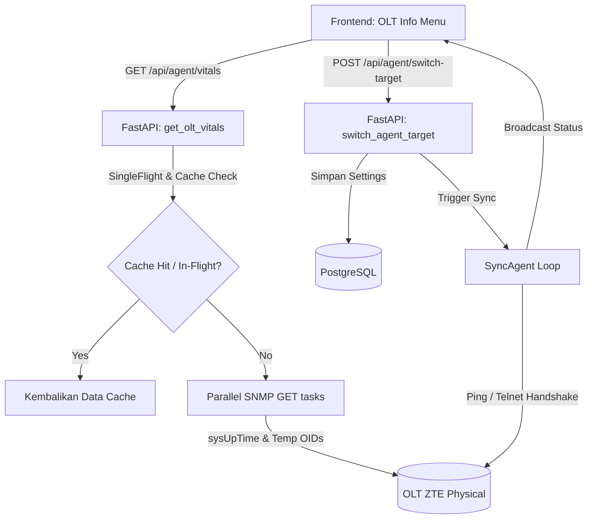

# Dokumentasi Arsitektur Backend Menu: OLT Info (Vitals & Sync Agent)

Dokumen ini menjelaskan secara rinci sistem backend yang bekerja untuk mendukung menu **OLT Info** (Vitals & Status Target) pada aplikasi **OptiProv**. Bagian ini mencakup alur API, protokol komunikasi (SNMP & Telnet), detail OID, mekanisme sinkronisasi di latar belakang, serta aspek keamanannya.

---

## 1. Arsitektur Komponen Backend

Menu OLT Info didukung oleh dua proses utama di backend:
1. **Endpoint API Vitals (`/api/agent/vitals`)**: Mengambil data telemetri fisik OLT secara real-time.
2. **Sync Agent (`SyncAgent` / `/api/agent/switch-target`)**: Memantau keaktifan perangkat, mendeteksi tipe hardware OLT target, dan menyinkronkan statusnya secara berkala.



---

## 2. Telemetri Fisik OLT (`/api/agent/vitals`)

Endpoint ini berfungsi mengambil suhu internal OLT, batas ambang suhu (threshold), dan masa aktif (uptime) OLT yang terhubung.

### A. Protokol & Polling (SNMP GET)
Pengambilan data menggunakan protokol **SNMP GET** secara paralel melalui `asyncio.gather(*tasks)` pada port **161** dengan timeout **3 detik**. Hal ini memastikan penarikan data tidak memblokir event loop backend.

### B. Pemetaan OID Berdasarkan Tipe OLT

#### 1. ZTE C3xx (C300 & C320)
*   **Suhu Perangkat (Temperature):** OID `.1.3.6.1.4.1.3902.1082.10.10.2.1.5.1.3.1.1`
*   **Batas Suhu Rendah (Low Threshold):** OID `.1.3.6.1.4.1.3902.1082.10.10.2.1.5.1.6.1.1`
*   **Batas Suhu Tinggi (High Threshold):** OID `.1.3.6.1.4.1.3902.1082.10.10.2.1.5.1.4.1.1`
*   **Batas Suhu Kritis (Critical Threshold):** OID `.1.3.6.1.4.1.3902.1082.10.10.2.1.5.1.5.1.1`

#### 2. ZTE C6xx (C600, C620, dll.)
*   **Suhu Perangkat (Temperature):** OID `1.3.6.1.4.1.3902.3.6002.2.4.1.3.1.1`
*   **Batas Suhu Rendah (Low Threshold):** OID `1.3.6.1.4.1.3902.3.6002.2.4.1.4.1.1`
*   **Batas Suhu Tinggi (High Threshold):** OID `1.3.6.1.4.1.3902.3.6002.2.4.1.6.1.1`
*   **Batas Suhu Kritis (Critical Threshold):** OID `1.3.6.1.4.1.3902.3.6002.2.4.1.5.1.1`

#### 3. Uptime Global (RFC-1213)
*   **OID Uptime:** `.1.3.6.1.2.1.1.3.0` (`sysUpTime`)
*   **Operasi & Formula:**
    *   Mengembalikan nilai dalam satuan *Timeticks* (1/100 detik).
    *   Backend mengekstrak nilai numerik menggunakan ekspresi reguler `\((\d+)\)`.
    *   Hasil nilai mentah dibagi 100 untuk mendapatkan detik, kemudian diformat menjadi representasi waktu yang dapat dibaca manusia (misal: `3d 12h 45m 12s`).

### C. Optimasi & Proteksi Stampede
*   **Memory Cache:** Hasil query disimpan dalam global cache `vitals_cache` dengan *Time-To-Live* (TTL) **30 detik**.
*   **SingleFlight (`_sf.do`)**: Mencegah *cache stampede* ketika banyak tab browser memanggil endpoint secara bersamaan. Hanya satu request SNMP GET yang dikirim ke OLT, sementara request lain menunggu hasil yang sama.
*   **Master Kill Switch State:** Jika agen sedang dalam status `LOADING` (pergantian OLT), penarikan SNMP dinonaktifkan untuk menghindari error koneksi, langsung mengembalikan status `"Syncing..."`.

---

## 3. Agen Sinkronisasi Latar Belakang (`SyncAgent`)

Kelas background worker `SyncAgent` (`backend/sync_agent.py`) memantau status keselarasan antara konfigurasi OLT di database dengan perangkat fisik.

### A. Verifikasi Ping / Jaringan
Setiap loop (5 detik), agen mengirimkan request ping ke IP OLT target. Jika ping diblokir oleh firewall OLT, agen melakukan fallback dengan mencoba membuka port Telnet untuk memeriksa reachability.

### B. Handshake & Verifikasi Identitas via Telnet
Untuk memastikan OLT yang terhubung memiliki tipe yang sesuai dengan konfigurasi profil, agen melakukan handshake menggunakan kredensial login terenkripsi:
1.  Membuka sesi Telnet ke perangkat.
2.  Mengeksekusi command:
    ```bash
    show version-running
    show card
    ```
3.  Memindai hasil output untuk mencari kecocokan kata kunci hardware (`type_keywords`):
    *   **c600:** `C600`, `ZXAN-C600`, `SFUB`, `SFUL`, `SFQD`, `SFUC`
    *   **c300:** `C300`, `ZXAN-C300`, `SCXN`, `SCXM`, `SCXL`
    *   **c320:** `C320`, `ZXAN-C320`, `SMXA`, `PRAM`
4.  Jika tipe hardware yang terdeteksi cocok dengan `selected_olt_id`, status koneksi diset ke `MATCH`. Jika berbeda, diset ke `MISMATCH`.

### C. Proteksi Sesi Terminal Aktif
Jika terdeteksi ada terminal aktif (`self.terminal_active_count > 0`), agen sinkronisasi akan menangguhkan perintah handshake Telnet untuk menghindari konflik pengetikan liar (*ghost typing*) di sesi pengguna.

---

## 4. Mekanisme Keamanan (Security Layer)

1.  **Otentikasi Endpoint**: Endpoint `/api/agent/vitals` dan `/api/agent/switch-target` dilindungi oleh decorator FastAPI `Depends(get_current_user)`. Sesi dinilai menggunakan cookie JWT bertanda (`olt_session`).
2.  **Enkripsi Kredensial**: Password akun Telnet dan password mode `enable` disimpan di database PostgreSQL secara terenkripsi menggunakan modul simetris **Fernet** (`cryptography`). Dekripsi hanya dilakukan di RAM backend saat `SyncAgent` membuka koneksi Telnet ke perangkat OLT.
