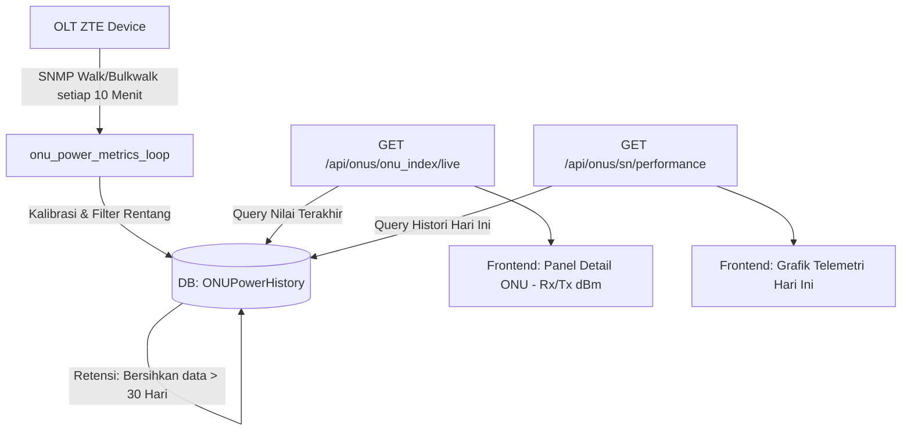

# Arsitektur Backend & Mekanisme ONU List (OptiProv)

Dokumen ini menjelaskan secara rinci sistem backend yang bekerja di balik menu **ONU List** pada aplikasi **OptiProv**, mulai dari alur API, operasi SNMP (Walk, Bulkwalk, SET), sesi Telnet, hingga fitur optimasi, telemetri, dan keamanan yang diterapkan.

---

## 1. Alur Kerja & API Endpoint

Halaman ONU List di frontend Next.js berinteraksi dengan FastAPI backend melalui beberapa route utama berikut:

| HTTP Method | Route | Fungsi Backend | Keterangan |
| :--- | :--- | :--- | :--- |
| **GET** | `/api/onus/details` | `get_onu_details` | Mengambil daftar ONU hasil discovery (Unregistered & Unconfigured) |
| **GET** | `/api/onus/{onu_index}/live` | `get_onu_live_status` | Memperoleh status real-time, IP WAN, dan Daya Optik ONU terbaru dari database |
| **GET** | `/api/onus/{sn}/performance` | `get_onu_performance` | Mengambil riwayat daya optik (Rx/Tx) dan suhu hari ini untuk grafik |
| **POST** | `/api/onus/register` | `register_onu` | Mendaftarkan ONU baru ke port OLT via SNMP SET |
| **POST** | `/api/onus/reboot` | `reboot_onus` | Memulai proses reboot fisik ONU via SNMP SET |
| **POST** | `/api/onus/delete` | `delete_onus` | Menghapus konfigurasi ONU dari port OLT via SNMP SET (destroy) |
| **POST** | `/api/onus/{onu_index}/verify-wan` | `verify_wan_details` | Memaksa query Telnet instan untuk memperbarui status WAN IP |

---

## 2. Operasi SNMP (Walk, Bulkwalk, & SET)

Interaksi hardware ke perangkat OLT ZTE diproses secara non-blocking menggunakan pustaka `pysnmp` v7.x di dalam `backend/snmp_manager.py`.

### A. Translasi Indeks Port GPON (`translated_port`)
OLT ZTE mengidentifikasi port fisik dengan indeks integer 32-bit. Konversi dilakukan menggunakan operasi bitwise shift berikut:
```python
translated_port = (1 << 28) | (1 << 24) | (shelf << 16) | (slot << 8) | port
```
Suffix akhir OID target dikonstruksi dalam format: `.{translated_port}.{onu_id}`.

### B. Pengecekan Discovery (Walk / Bulkwalk)

#### 1. Discovery ONU Unregistered (Belum Teregistrasi)
*   **ZTE C6xx (C600):** Base OID `1.3.6.1.4.1.3902.1082.500.2.2.11.2.1`
    *   Walk OID `.2` $\rightarrow$ Serial Number (`sn`)
    *   Walk OID `.8` $\rightarrow$ Model Perangkat (`equipment_id`)
    *   Walk OID `.10` $\rightarrow$ Software Version (`software_version`)
    *   Walk OID `.11` $\rightarrow$ Hardware Version (`hw_version`)
*   **ZTE C3xx (C320):** Base OID `1.3.6.1.4.1.3902.1082.500.10.2.2.5.1`
    *   Walk OID `.2` $\rightarrow$ Serial Number (`sn`)
    *   Walk OID `.7` $\rightarrow$ Model Perangkat (`equipment_id`)
    *   Walk OID `.8` $\rightarrow$ Software Version (`software_version`)

#### 2. Discovery ONU Unconfigured (Sudah Teregistrasi tapi Belum In-Service)
*   **ZTE C3xx / C6xx:** Base OID `1.3.6.1.4.1.3902.1082.500.10.2.3.3.1`
    *   Walk OID `.2` $\rightarrow$ Nama ONU (`name`)
    *   Walk OID `.3` $\rightarrow$ Deskripsi ONU (`description`)
    *   Walk OID `.18` $\rightarrow$ Serial Number (`sn`)
*   **Status LOS / Phase State:** OID `1.3.6.1.4.1.3902.1082.500.10.2.3.8.1.4`
    Nilai integer didekodekan sebagai status berikut:
    *   `1` $\rightarrow$ Logging
    *   `2` $\rightarrow$ LOS (Loss of Signal / Kabel Putus)
    *   `3` $\rightarrow$ SyncMib
    *   `5` $\rightarrow$ DyingGasp (Mati Listrik)
    *   `6` $\rightarrow$ AuthFailed
    *   `7` $\rightarrow$ Offline

### C. Aksi Mutasi (SNMP SET)

#### 1. Registrasi ONU (`register_onu`)
*   String Serial Number (misal `ZXHN12345678`) diubah menjadi format Hex-String agar kompatibel dengan OID `Hex-STRING` OLT. 4 karakter pertama (vendor code) dikodekan ke ASCII hex, lalu digabungkan dengan sisa karakter SN.
*   Pendaftaran dieksekusi via `_local_snmp_set_registration`.

#### 2. Reboot Fisik ONU (`reboot_onus`)
Mengirim SNMP SET dengan nilai integer `1` ke OID kendali reboot:
*   **OID:** `1.3.6.1.4.1.3902.1082.500.20.2.1.10.1.1.{translated_port}.{onu_id}`
*   **Value:** `1` (Integer)

#### 3. Penghapusan ONU (`delete_onus`)
Mengirim SNMP SET dengan nilai `6` (Destroy) untuk menghapus baris konfigurasi ONU (RowStatus) pada OLT:
*   **OID:** `1.3.6.1.4.1.3902.1082.500.10.2.3.3.1.50.{translated_port}.{onu_id}`
*   **Value:** `6` (Integer)

---

## 3. Sistem Telemetri (Rx/Tx Power & Suhu ONU)

Backend memantau data daya optik (Rx/Tx) dan suhu ONU secara terjadwal untuk mendeteksi gangguan jaringan.

### A. SNMP OID & Operasi untuk Telemetri
Proses pengambilan telemetri berjalan di latar belakang setiap 10 menit sekali via `onu_power_metrics_loop` di `backend/main.py`. Operasi yang digunakan adalah **SNMP Bulkwalk** (dengan fallback **SNMP Walk**):

1.  **Daya Optik Rx (Received Power):**
    *   **OID:** `1.3.6.1.4.1.3902.1082.500.20.2.2.2.1.10`
2.  **Daya Optik Tx (Transmit Power):**
    *   **OID:** `1.3.6.1.4.1.3902.1082.500.20.2.2.2.1.14`
3.  **Suhu ONU (Device Temperature):**
    *   **OID:** `1.3.6.1.4.1.3902.1082.500.20.2.2.2.1.19`
4.  **Serial Number Mapping:**
    *   **OID (C3xx):** `1.3.6.1.4.1.3902.1082.500.10.2.3.1.1.5`
    *   **OID (C6xx):** `1.3.6.1.4.1.3902.1082.500.10.2.3.1.1.18`
    *(Digunakan untuk memetakan index suffix `.{translated_port}.{onu_id}` dari hasil walk daya optik ke Serial Number ONU masing-masing).*

### B. Formula Konversi & Kalibrasi Telemetri
Data mentah (`raw_value`) dari SNMP dikonversi dengan aturan berikut (Unifikasi ZTE C600 & C320):

*   **Daya Optik (Rx & Tx):**
    Formula:
    $$dBm = (V_{raw} \times 0.002) - 30$$
    *Catatan: Menggunakan koreksi komplemen dua (two's complement) 16-bit jika $V_{raw} \ge 32768$ ($V_{raw} = V_{raw} - 65536$).*
    *   **Filter Validasi Rx:** Daya Rx harus berada dalam rentang **$-32.0\text{ dBm}$ s.d. $-14.0\text{ dBm}$**. Di luar rentang ini dianggap anomali (kabel tercabut/LOS) dan disimpan sebagai `None` (JSON `null`).
    *   **Filter Validasi Tx:** Daya Tx harus berada dalam rentang **$-10.0\text{ dBm}$ s.d. $+12.0\text{ dBm}$**. Di luar rentang ini disimpan sebagai `None` (JSON `null`).

*   **Suhu Perangkat (Temperature):**
    Formula:
    $$Suhu = V_{raw} / 256.0$$
    *   **Filter Validasi Suhu:** Suhu harus berada dalam rentang **$-30.0^\circ\text{C}$ s.d. $+80.0^\circ\text{C}$**. Di luar rentang ini disimpan sebagai `None` (JSON `null`).

---

## 4. Aliran Penyimpanan & Tampilan Data Telemetri

Setelah daya optik dan suhu dihitung dan divalidasi, data ini dialirkan ke sistem database dan UI dengan alur berikut:



### A. Penyimpanan Database (`ONUPowerHistory`)
Kombinasi telemetri disimpan pada tabel **`ONUPowerHistory`** (`models_db.py`) yang memiliki skema:
*   `serial_number` (String, Indexed)
*   `olt_ip` (String)
*   `rx_power` (Float, Nullable)
*   `tx_power` (Float, Nullable)
*   `temperature` (Float, Nullable)
*   `timestamp` (DateTime, GMT+7)

Setiap siklus poll selesai, backend secara otomatis menghapus data histori yang berusia **lebih dari 30 hari** untuk mencegah pembengkakan ukuran database.

### B. Penayangan di User Interface (UI)
Data dari database tersebut diekspos melalui API untuk kemudian ditampilkan di frontend Next.js:

1.  **Status Live di Panel Detail:**
    *   Ketika pengguna mengklik salah satu ONU di daftar, frontend memanggil endpoint `/api/onus/{onu_index}/live`.
    *   Backend melakukan query nilai terakhir dari `ONUPowerHistory` berdasarkan Serial Number ONU tersebut.
    *   Data ini dirender secara langsung sebagai status status barometer daya optik **Rx (dBm)** dan **Tx (dBm)** di panel detail. Jika nilai bernilai `null` (`None`), frontend memformatnya menjadi `"-"`.
2.  **Grafik Kinerja Telemetri (Performance Charts):**
    *   Frontend memanggil endpoint `/api/onus/{sn}/performance`.
    *   Backend mengembalikan data tren daya optik dan suhu mulai dari pukul **`00:00:00`** waktu lokal hari ini (GMT+7).
    *   Frontend menyajikannya dalam bentuk **Interactive Area/Line Charts** untuk memantau fluktuasi redaman kabel optik sepanjang hari.

---

## 5. Pengecekan WAN IP (Telnet Automation)

Untuk memperoleh informasi detail WAN IP, mode konfigurasi, username PPPoE, dan hostname ONU, backend berkomunikasi dengan CLI OLT via Telnet.

### A. Perintah CLI yang Dijalankan
```bash
show gpon remote-onu wan-ip <prefix><shelf>/<slot>/<port>:<onu_id>
```
*   **Prefix Dinamis:** Disesuaikan berdasarkan tipe OLT (`gpon-onu_` untuk tipe C3xx / C320, dan `gpon_onu-` untuk tipe C6xx / C600).
*   Output string terminal diparsing menggunakan regex parser (`_parse_onu_wan_ip_output`) untuk diekstrak ke database.

### B. Pengelolaan Sesi (`TelnetSessionManager`)
Untuk menjaga keandalan terminal OLT dan mencegah beban berlebih:
1.  **Session Cache & Locking:** Sesi Telnet disimpan di memory cache (`self.sessions`) per IP. Akses ke socket dilindungi menggunakan mutex lock (`threading.Lock()`) per OLT IP guna menghindari tabrakan thread.
2.  **Prompt Sanitizer:** Sebelum perintah dikirim, manager melakukan pembersihan buffer sisa dan memastikan terminal tidak tersangkut di sub-mode CLI (seperti mode config `gpon-onu-mng` atau interface config) dengan mengirimkan command `exit` berulang hingga prompt kembali ke root (`#` or `>`).
3.  **Keepalive Worker:** Thread latar belakang mengirim newline (`\n`) setiap 45 detik untuk mencegah sesi timeout (terkecuali sistem sedang hibernasi karena tidak ada aktivitas pengguna selama 5 menit).
4.  **Circuit Breaker:** Jika koneksi Telnet ke OLT terputus, timeout, atau menolak koneksi (karena limitasi OLT), *Circuit Breaker* aktif (`telnet_circuit_broken = True`). Sistem akan melewati pengecekan Telnet langsung pada sisa list ONU dan beralih menggunakan fallback cache WAN IP dari database lokal demi menjaga kecepatan load halaman.

---

## 6. Keamanan & Optimasi Backend

### A. Proteksi Cache Stampede (`SingleFlight`)
Untuk menghindari penumpukan query ke OLT saat beberapa operator membuka halaman ONU list secara bersamaan, backend mengimplementasikan pola **`SingleFlight`** (`_sf`). Request dengan key yang sama (`onu_details:{active_ip}:{refresh}:{force}`) akan digabungkan, dan request kedua serta seterusnya hanya akan menunggu hasil eksekusi request pertama tanpa memicu walk baru.

### B. Enkripsi Kredensial OLT & Proteksi JWT
*   Password login dan password enable OLT yang disimpan di database dienkripsi secara aman menggunakan **Fernet Cryptography (Symmetric Encryption)**.
*   Dekripsi dilakukan secara runtime menggunakan kunci dinamis saat Telnet melakukan handshake.
*   Seluruh rute API dilindungi oleh autentikasi berbasis cookie session JWT (`Depends(get_current_user)`).
