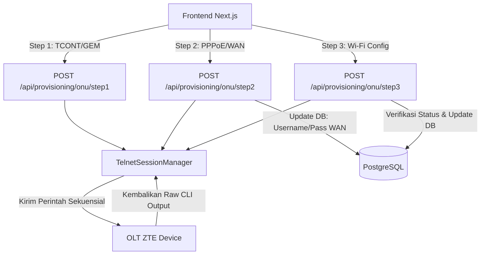

# Dokumentasi Sistem 3-Step OMCI Provisioning Wizard (OptiProv)

Dokumen ini menjelaskan arsitektur teknis, alur data, variasi perintah CLI Telnet untuk tipe OLT ZTE (C3xx & C6xx), manajemen sesi, serta sistem keamanan yang bekerja di balik fitur **3-Step OMCI Provisioning Wizard** pada aplikasi **OptiProv**.

---

## 1. Arsitektur Umum & Alur Proses

Fitur 3-Step OMCI Provisioning Wizard dirancang untuk melakukan konfigurasi ONU secara bertahap langsung melalui OMCI (Optical Network Terminal Management and Control Interface) tanpa mengganggu operasi monitoring latar belakang. 



Setiap endpoint FastAPI di backend dilindungi oleh dekorator autentikasi JWT dan memanfaatkan pustaka Telnet untuk berkomunikasi secara asinkron (non-blocking) dengan perangkat OLT.

---

## 2. Rincian Langkah (Step-by-Step) & Perintah Telnet

### Step 1: Hardware & TCONT/GEMPort Configuration
* **Endpoint:** `POST /api/provisioning/onu/step1`
* **Pydantic Model:** `ONUProvisioningStep1Request`
* **Tujuan:** Membuat alokasi bandwidth (TCONT) dan memetakan GEM Port ke TCONT tersebut pada sisi antarmuka ONU di OLT.

#### Perintah Telnet ZTE C6xx:
```bash
configure terminal
interface gpon_onu-<shelf>/<slot>/<port>:<onu_id>
tcont <tcont_no> profile <tcont_profile>
gemport <gemport_no> tcont <tcont_no>
exit
```

#### Perintah Telnet ZTE C3xx:
```bash
configure terminal
interface gpon-onu_<shelf>/<slot>/<port>:<onu_id>
tcont <tcont_no> profile <tcont_profile>
gemport <gemport_no> tcont <tcont_no>
service-port <service_port> vport <vport> user-vlan <vlan_id> transparent
exit
```

> [!NOTE]
> Perbedaan utama di Step 1 adalah pembuatan `service-port` pada ZTE C3xx dilakukan langsung di bawah konfigurasi antarmuka fisik ONU, sedangkan untuk ZTE C6xx konfigurasi `service-port` dipindahkan ke Step 2 melalui antarmuka virtual `vport`.

---

### Step 2: Service & WAN/PPPoE Configuration
* **Endpoint:** `POST /api/provisioning/onu/step2`
* **Pydantic Model:** `ONUProvisioningStep2Request`
* **Tujuan:** Membuat profil layanan IP WAN (PPPoE), melakukan bridging VEIP ke mode transparent, mengonfigurasi IP WAN ONU, serta mengaktifkan protokol akses manajemen keamanan (HTTP/Telnet) dari sisi WAN.

#### Perintah Telnet ZTE C6xx:
```bash
configure terminal
pon-onu-mng gpon_onu-<shelf>/<slot>/<port>:<onu_id>
service <service_name> gemport <gemport_no> vlan <vlan_id>
vlan port veip_<veip_name> mode transparent
wan-ip <wan_ip_index> ipv4 mode pppoe username <username> password <password> vlan-profile <vlan_profile> host <host>
wan <wan> service internet host <host>
security-mgmt <security_mgmt_num> ingress-type wan mode forward state enable protocol <protocols_str>
exit
interface vport-<shelf>/<slot>/<port>.<onu_id>:<gemport_no>
service-port <service_port> user-vlan <vlan_id> vlan <vlan_id>
exit
```

#### Perintah Telnet ZTE C3xx:
```bash
configure terminal
pon-onu-mng gpon-onu_<shelf>/<slot>/<port>:<onu_id>
service <service_name> gemport <gemport_no> vlan <vlan_id>
vlan port veip_<veip_name> mode transparent
wan-ip <wan_ip_index> mode pppoe username <username> password <password> vlan-profile <vlan_profile> host <host>
wan <wan> service internet host <host>
security-mgmt <security_mgmt_num> ingress-type wan mode forward state enable protocol <protocols_str>
exit
```

> [!TIP]
> Nilai `<protocols_str>` dikonstruksi dari array input protokol manajemen di UI (misal `["web", "telnet"]` menjadi `"web telnet"`).
> Setelah perintah Telnet sukses dijalankan, backend memperbarui kolom `wan_username`, `wan_password`, dan `wan_ip_index` di tabel `unconfigured_onus` pada database PostgreSQL.

---

### Step 3: Wi-Fi Configuration & Completion
* **Endpoint:** `POST /api/provisioning/onu/step3`
* **Pydantic Model:** `ONUProvisioningStep3Request`
* **Tujuan:** Mengonfigurasi nama SSID, status lock/unlock SSID, visibilitas SSID (hidden/visible), serta tipe autentikasi beserta kata sandi Wi-Fi pada perangkat ONU.

#### Kondisional UI & Opsi Autentikasi:
Menu dropdown autentikasi Wi-Fi di frontend disaring berdasarkan tipe OLT aktif:
* **ZTE C3xx:** Hanya mendukung opsi `Open System`, `WPA-PSK`, `WPA/WPA2-PSK`, dan `WPA2-PSK`.
* **ZTE C6xx:** Mendukung opsi di atas ditambah opsi modern `WPA3-SAE` dan `WPA2-PSK/WPA3-SAE`.

#### Perintah Telnet:
Backend memulai sesi dengan:
```bash
configure terminal
pon-onu-mng <prefix><shelf>/<slot>/<port>:<onu_id>
```
Kemudian, untuk setiap item Wi-Fi yang dikonfigurasi di UI, backend menambahkan perintah kontrol SSID:
```bash
ssid ctrl wifi_<slot>/<port> name <ssid_name>[ max-users <max_users>] hide <enable/disable>
```
Diikuti perintah konfigurasi enkripsi tergantung pada `auth_type`:
* **Jika `auth_type` adalah `"open-system"`:**
  ```bash
  ssid auth wep wifi_<slot>/<port> open-system
  ```
* **Jika `auth_type` menggunakan enkripsi WPA (ZTE C6xx):**
  ```bash
  ssid auth wpa wifi_<slot>/<port> auth-algorithm <auth_type> key <passphrase>
  ```
* **Jika `auth_type` menggunakan enkripsi WPA (ZTE C3xx):**
  ```bash
  ssid auth wpa wifi_<slot>/<port> <auth_type> key <passphrase>
  ```

Diakhiri dengan perintah keluar:
```bash
exit
```

> [!IMPORTANT]
> Ketika Step 3 sukses dieksekusi, backend tidak langsung menutup sesi melainkan menjalankan perintah Telnet verifikasi (`show gpon remote-onu wan-ip ...`) secara otomatis untuk memeriksa status akhir koneksi. Hasil verifikasi (apakah ONU berstatus `"Online"` atau `"Unconfigured"`) diperbarui di database PostgreSQL dan dikirimkan ke frontend. Menu Step 3 di frontend akan menampilkan hasil verifikasi tersebut dan melakukan hitung mundur selama 10 detik sebelum otomatis tertutup dan kembali ke halaman ONU List.

---

## 3. Sistem Manajemen Sesi Telnet (`TelnetSessionManager`)

Untuk memastikan kestabilan koneksi CLI ke hardware OLT, backend menggunakan sistem pengelolaan sesi terpadu:

1. **Persistent Connection Caching:** Sesi Telnet tidak ditutup setiap kali transaksi selesai. Koneksi dijaga tetap terbuka dan di-cache per IP OLT. Thread keepalive latar belakang mengirimkan karakter newline (`\n`) setiap 45 detik untuk mencegah koneksi diputus secara paksa oleh timeout OLT.
2. **Global & IP Locking:** Setiap akses command Telnet dibungkus menggunakan lock mutex (`threading.Lock()`) per OLT IP. Hal ini menjamin tidak ada tabrakan eksekusi command ketika ada beberapa operator melakukan provisioning secara bersamaan.
3. **Automatic Prompt Sanitizer (Self-Healing):** Sebelum mengirimkan rangkaian perintah baru, manager memeriksa prompt CLI terakhir. Jika sesi sebelumnya terputus di tengah jalan pada mode konfigurasi (misal prompt berupa `(config-if)#` atau `gpon-onu-mng`), manager secara otomatis mengirimkan perintah `exit` berulang kali untuk mengembalikan posisi prompt ke root (`#` atau `>`).
4. **Echo Stripping:** OLT ZTE C6xx memantulkan kembali setiap perintah masukan ke terminal keluaran. Backend mendeteksi perilaku ini dan memotong baris echo masukan (termasuk baris dengan tanda `$` hasil pembungkusan teks) agar log teks keluaran yang disimpan bersih.
5. **Auditing & History Logs:** Setiap raw CLI output yang dihasilkan dari Step 1, 2, dan 3 disimpan ke tabel `ONUCLILog` di PostgreSQL lengkap dengan timestamp UTC untuk kebutuhan audit sistem.

---

## 4. Keamanan Sistem (Security Layer)

* **Autentikasi API:** Akses ke ketiga rute API provisioning dilindungi dengan memvalidasi tanda tangan enkripsi token JWT yang dikirimkan melalui cookie browser `olt_session`. Pengecekan dijalankan melalui FastAPI dependency injection: `Depends(get_current_user)`.
* **Enkripsi Kredensial Perangkat:** Username, password telnet, dan password `enable` OLT disimpan di database PostgreSQL dalam bentuk terenkripsi menggunakan algoritma **Fernet (Symmetric Encryption)**. Proses dekripsi kunci hanya berjalan di memori (RAM) secara dinamis saat melakukan autentikasi handshake Telnet ke hardware.
