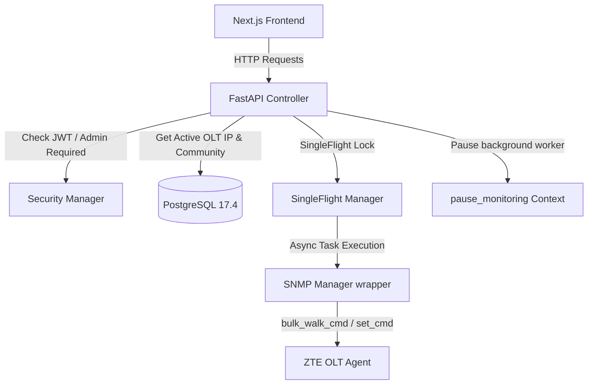

# Arsitektur & Dokumentasi Backend: ONU Profile VLAN (Provisioning)

Dokumen ini menjelaskan secara rinci arsitektur, alur data, formula SNMP, pemetaan OID, logika penamaan indeks (suffix), serta sistem keamanan pada sub-menu **ONU Profile VLAN** di dalam modul **Provisioning** pada sistem **OptiProv**.

---

## 1. Perbedaan Mendasar dengan VLAN Global
*   **VLAN Global (ZTE MIB `1082.40.50`):** Digunakan untuk membuat, mengedit, atau menghapus ID VLAN secara global di dalam switch core OLT.
*   **ONU Profile VLAN (ZTE MIB `1082.500.20`):** Digunakan untuk mendefinisikan profil VLAN khusus yang akan diterapkan pada ONU/ONT sisi pelanggan (melalui protokol OMCI). Profil ini mengikat mode VLAN (tag/transparent), VLAN ID, dan prioritas CoS (Class of Service).

---

## 2. Arsitektur Komponen Backend

Aplikasi backend menggunakan arsitektur asinkron berbasis **FastAPI** dengan pembagian tanggung jawab sebagai berikut:



1.  **FastAPI Router Controller:** Menerima payload dari frontend dan melakukan parsing menggunakan Pydantic Schema Validator.
2.  **Database Layer (SQLAlchemy):** Menyediakan sesi PostgreSQL untuk memuat konfigurasi profil OLT yang aktif (IP OLT, port SNMP, community string).
3.  **SNMP Manager (`snmp_manager.py`):** Menggunakan `pysnmp` 7.x untuk berkomunikasi secara asinkron dengan OLT.
4.  **SingleFlight & Cache Manager:** Menghindari thundering herd/cache stampede jika terdapat akses konkuren ke menu provisioning.
5.  **Thread Concurrency Coordinator (`pause_monitoring`):** Menghentikan aktivitas worker monitoring status ONU/OLT sementara agar query penulisan SNMP SET tidak diblokir atau mengalami tabrakan frekuensi.

---

## 3. Logika Indexing OID Suffix (ASCII Encoding/Decoding)

ZTE menggunakan metode dinamis dalam pemetaan baris tabel di MIB untuk entitas yang memiliki kunci utama berupa string (seperti nama profil). Nama profil dikonversi menjadi representasi numerik ASCII di akhir OID (suffix).

### Formula Suffix
$$\text{Suffix} = \text{panjang\_string} . \text{ascii\_char\_1} . \text{ascii\_char\_2} \dots . \text{ascii\_char\_n}$$

#### Contoh Kasus:
Jika nama profil VLAN adalah `"WIFI"`:
*   Panjang kata `"WIFI"` = `4`
*   ASCII dari 'W' = `87`
*   ASCII dari 'I' = `73`
*   ASCII dari 'F' = `70`
*   ASCII dari 'I' = `73`
*   **Indeks Suffix:** `.4.87.73.70.73`

#### Implementasi Python:
```python
# Mengubah string menjadi suffix OID
def string_to_oid_suffix(text: str) -> str:
    if not text:
        return "0"
    length = len(text)
    ascii_vals = [str(ord(c)) for c in text]
    return f"{length}.{'.'.join(ascii_vals)}"

# Mendecode suffix OID kembali menjadi string
def decode_oid_ascii_suffix(suffix: str) -> str:
    try:
        parts = suffix.strip('.').split('.')
        chars = [chr(int(x)) for x in parts[1:]]
        return "".join(chars)
    except Exception:
        return suffix
```

---

## 4. Endpoint API & Operasi SNMP Detail

### Root OID Tabel
Untuk seluruh operasi ONU Profile VLAN, root table yang digunakan adalah:
$$\text{Root OID} = \text{1.3.6.1.4.1.3902.1082.500.20.2.6.25.1}$$

---

### A. GET: Mengambil Daftar Profil
*   **Endpoint:** `GET /api/provisioning/onu-profiles`
*   **Parameter:** `refresh: bool`
*   **Operasi SNMP:** `BULKWALK`
*   **Alur Logika:**
    1. Cek cache lokal memori (`onu_profile_cache`) berdasarkan IP OLT. Jika cache valid (TTL < 30 menit) dan `refresh=False`, kembalikan data langsung.
    2. Jika cache miss/expired, SingleFlight diaktifkan menggunakan key `onu-profiles:{ip}:{refresh}`.
    3. Di dalam executor thread, lakukan `BULKWALK` pada root OID `1.3.6.1.4.1.3902.1082.500.20.2.6.25.1` dengan `max_repetitions=100`.
    4. Kelompokkan hasil parsing berdasarkan sub-kolom berikut:
        *   **Kolom `2` (VLAN Mode):** `1.3.6.1.4.1.3902.1082.500.20.2.6.25.1.2.<suffix>` (Jika bernilai `1`, maka mode = `"tag"`).
        *   **Kolom `3` (CVLAN ID):** `1.3.6.1.4.1.3902.1082.500.20.2.6.25.1.3.<suffix>` (Berisi VLAN ID integer).
        *   **Kolom `4` (CVLAN Priority):** `1.3.6.1.4.1.3902.1082.500.20.2.6.25.1.4.<suffix>` (Berisi prioritas/PCP).
    5. Decode suffix OID untuk memetakan kembali nilai-nilai kolom tersebut ke nama profil aslinya.
    6. Update cache memori lokal.

---

### B. POST: Menambah Profil Baru
*   **Endpoint:** `POST /api/provisioning/onu-profiles`
*   **Payload:** `ProvisioningOnuProfileRequest` (`profile_name`, `vlan_id`, `priority`)
*   **Operasi SNMP:** `SET` (Multi-Variable PDU)
*   **Alur Logika:**
    1. Konversi `profile_name` menjadi suffix OID.
    2. Susun payload OID multi-variable:
        *   `1.3.6.1.4.1.3902.1082.500.20.2.6.25.1.2.<suffix>` $\rightarrow$ Value: `1` (Integer - tag mode)
        *   `1.3.6.1.4.1.3902.1082.500.20.2.6.25.1.3.<suffix>` $\rightarrow$ Value: `vlan_id` (Integer)
        *   `1.3.6.1.4.1.3902.1082.500.20.2.6.25.1.4.<suffix>` $\rightarrow$ Value: `priority` (Integer)
        *   **`1.3.6.1.4.1.3902.1082.500.20.2.6.25.1.50.<suffix>` (RowStatus):** Value: **`4` (createAndGo)**. Status ini berfungsi untuk membuat baris tabel baru sekaligus mengaktifkannya pada OLT.
    3. Kirim paket PDU via `snmp.snmp_set_multi` di dalam context manager `pause_monitoring()`.
    4. Bersihkan cache lokal (`onu_profile_cache.pop(ip)`) untuk memicu query pembaruan data pada request GET berikutnya.

---

### C. PUT: Mengedit Profil
*   **Endpoint:** `PUT /api/provisioning/onu-profiles`
*   **Payload:** `ProvisioningOnuProfileEditRequest` (`profile_name`, `vlan_id`, `priority`)
*   **Operasi SNMP:** `SET`
*   **Alur Logika:**
    1. Konversi nama profil menjadi suffix OID.
    2. Susun payload OID SET **tanpa** status RowStatus (kolom `.50`) dan Tag Mode (kolom `.2`) untuk mencegah error `inconsistentValue` dari OLT:
        *   `1.3.6.1.4.1.3902.1082.500.20.2.6.25.1.3.<suffix>` $\rightarrow$ Value: `vlan_id` (Integer)
        *   `1.3.6.1.4.1.3902.1082.500.20.2.6.25.1.4.<suffix>` $\rightarrow$ Value: `priority` (Integer)
    3. Kirim multi-SET ke OLT di dalam `pause_monitoring()`. Cache lokal dihapus.

---

### D. DELETE: Menghapus Profil
*   **Endpoint:** `DELETE /api/provisioning/onu-profiles`
*   **Payload:** `ProvisioningOnuProfileDeleteRequest` (`profile_names: list[str]`)
*   **Operasi SNMP:** `SET`
*   **Alur Logika:**
    1. Lakukan perulangan untuk setiap nama profil yang diajukan.
    2. Konversi nama profil menjadi suffix OID.
    3. Targetkan kolom RowStatus pada baris profil tersebut:
        *   `1.3.6.1.4.1.3902.1082.500.20.2.6.25.1.50.<suffix>` $\rightarrow$ Value: **`6` (destroy)**
    4. Eksekusi `snmp.snmp_set_int` untuk menghancurkan (destroy) entitas baris tabel di OLT.
    5. Cache lokal dibersihkan.

---

## 5. Mekanisme Proteksi Konkurensi & Transaksi

Untuk menjaga kestabilan perangkat OLT, backend menerapkan mekanisme berikut:

1.  **Context Manager `pause_monitoring()`:**
    Ketika mutasi (POST, PUT, DELETE) dikirimkan, program memanggil context manager ini yang mengubah status global thread monitoring asinkron. Hal ini menghentikan sementara polling SNMP bulkwalk statistik ONU yang berjalan di background. Tanpa proteksi ini, OLT berisiko gagal merespons akibat overload transaksi konkuren.
2.  **Thread Safe Async Wrapper:**
    Meskipun endpoint FastAPI dideklarasikan sebagai fungsi sinkron (`def`), komunikasi SNMP di-dispatch menggunakan thread executor baru yang menjalankan event loop asinkron secara terisolasi agar event loop utama FastAPI tidak terhambat (*non-blocking*).

---

## 6. Analisis Keamanan & Rekomendasi Audit (JWT Authentication Bypass)

### Sistem Keamanan yang Tersedia
*   **Rate Limiting:** Menggunakan `slowapi` untuk membatasi requests per IP client (membaca dari `X-Forwarded-For` Cloudflare).
*   **Session Management:** Memanfaatkan cookie `olt_session` (HttpOnly & SameSite=Lax) yang divalidasi dengan signature HMAC-SHA256 untuk memverifikasi keabsahan JWT session token.

### Temuan Celah Keamanan (Authentication Bypass)
Berdasarkan audit rute terbaru pada `backend/main.py`:
*   Rute `GET /api/provisioning/onu-profiles` terproteksi dengan dependency:
    `current_user: dict = Depends(get_current_user)`
*   **Namun**, rute-rute mutasi berikut **tidak memiliki** dependency otentikasi JWT:
    1.  `POST /api/provisioning/onu-profiles`
    2.  `PUT /api/provisioning/onu-profiles`
    3.  `DELETE /api/provisioning/onu-profiles`

Hal ini menimbulkan kerentanan keamanan tinggi, di mana pihak luar yang memiliki rute jaringan ke backend FastAPI dapat memodifikasi, mengedit, atau menghapus profil VLAN ONU langsung pada OLT tanpa harus melewati proses login.

### Rekomendasi Perbaikan
Segera tambahkan parameter otentikasi JWT pada definisi fungsi di backend:
```python
# Perbaikan POST
@app.post("/api/provisioning/onu-profiles")
def create_onu_profile(req: ProvisioningOnuProfileRequest, db: Session = Depends(get_db), current_user: dict = Depends(get_current_user)):
    ...

# Perbaikan PUT
@app.put("/api/provisioning/onu-profiles")
def edit_onu_profile(req: ProvisioningOnuProfileEditRequest, db: Session = Depends(get_db), current_user: dict = Depends(get_current_user)):
    ...

# Perbaikan DELETE
@app.delete("/api/provisioning/onu-profiles")
def delete_onu_profiles(req: ProvisioningOnuProfileDeleteRequest, db: Session = Depends(get_db), current_user: dict = Depends(get_current_user)):
    ...
```
Rencana perbaikan ini telah terdaftar di dalam [Implementation Plan](file:///C:/Users/hugop/.gemini/antigravity/brain/2480af59-7fc0-4a7e-ae89-5bd44e16b24e/implementation_plan.md) untuk dieksekusi setelah mendapatkan persetujuan pengguna.
