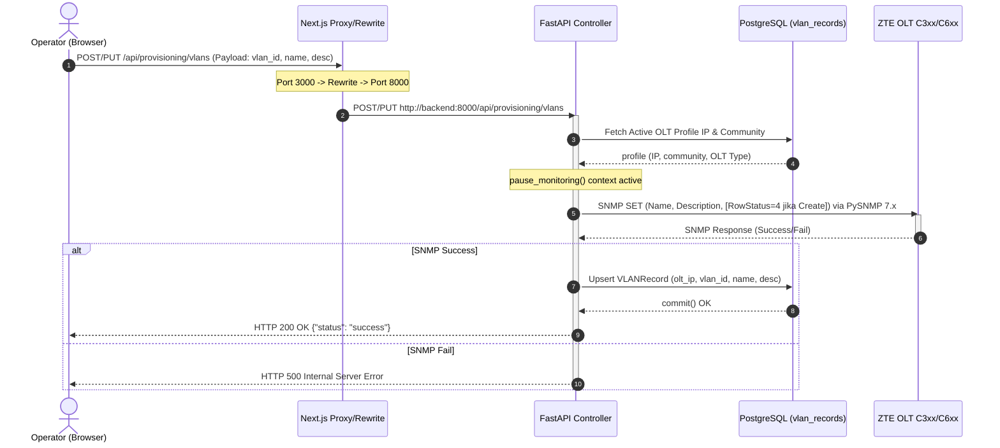

# Dokumentasi Backend: Sub-Menu Create & Edit VLAN (Provisioning)

Dokumen ini menjelaskan arsitektur backend, alur data, protokol SNMP (OID & operasi), skema basis data, serta analisis keamanan untuk fitur pembuatan dan pengeditan VLAN (bukan ONU profile VLAN) pada sub-menu **Create VLAN** di menu **Provisioning** aplikasi OptiProv.

---

## 1. Alur Kerja Sistem (End-to-End Flow)

Proses pembuatan dan pengeditan VLAN menggunakan sub-menu ini berjalan secara decoupled melalui arsitektur 3-Layer:



### Penjelasan Langkah Alur Jaringan:
1. **User Action:** Operator mengirimkan request pembuatan (HTTP POST) atau pengeditan (HTTP PUT) VLAN dari antarmuka Web UI.
2. **Next.js API Gateway Proxy:** Next.js frontend membelokkan request dari client browser (port `3000`) ke target backend container FastAPI (`backend:8000`) di dalam custom network Docker `olt_net`.
3. **Controller Handling:** FastAPI memproses request melalui endpoint [create_vlan](file:///c:/Users/hugop/Documents/Dokumentasi%20Web/OLT-WEB/backend/main.py#L2868) (untuk POST/Create) atau [update_vlan](file:///c:/Users/hugop/Documents/Dokumentasi%20Web/OLT-WEB/backend/main.py#L2908) (untuk PUT/Edit).
4. **OLT Lock Mechanism:** Sistem membungkus operasi SNMP Set dengan fungsi `pause_monitoring()` untuk mencegah tabrakan *concurrency* dengan thread polling berkala hardware OLT.
5. **SNMP Multi-Set PDU:** Mengirimkan payload PDU berisi variabel OID yang relevan.
6. **Local Database Persistence:** Menyimpan hasil konfigurasi ke database PostgreSQL agar status lokal sinkron dengan hardware.

---

## 2. Struktur API Backend (Controller Layer)

Endpoint untuk Create & Edit VLAN dideklarasikan di file [main.py](file:///c:/Users/hugop/Documents/Dokumentasi%20Web/OLT-WEB/backend/main.py).

### A. Skema Pydantic Request
Sistem memvalidasi input payload menggunakan skema model [ProvisioningVlanRequest](file:///c:/Users/hugop/Documents/Dokumentasi%20Web/OLT-WEB/backend/main.py#L525) berikut:

```python
class ProvisioningVlanRequest(BaseModel):
    vlan_id: int                    # ID VLAN wajib diisi (1 - 4094)
    name: Optional[str] = None      # Nama VLAN (Opsional, fallback ke VLANxxxx)
    description: Optional[str] = None # Keterangan/Deskripsi VLAN (Opsional)
```

### B. Implementasi Endpoint Create VLAN (POST)
Detail fungsi [create_vlan](file:///c:/Users/hugop/Documents/Dokumentasi%20Web/OLT-WEB/backend/main.py#L2868-L2905):

```python
@app.post("/api/provisioning/vlans")
def create_vlan(req: ProvisioningVlanRequest, db: Session = Depends(get_db)):
    profile = _get_active_profile(db)
    if not profile:
        raise HTTPException(status_code=400, detail="No active profile")
    
    ip = profile.in_band_ip
    community = profile.snmp_community or "public"
    vlan_id = req.vlan_id
    vlan_name = req.name or f"VLAN{vlan_id:04d}"
    
    name_oid = f".1.3.6.1.4.1.3902.1082.40.50.2.1.2.1.2.{vlan_id}"
    desc_oid = f".1.3.6.1.4.1.3902.1082.40.50.2.1.2.1.3.{vlan_id}"
    status_oid = f".1.3.6.1.4.1.3902.1082.40.50.2.1.2.1.50.{vlan_id}"
    
    logger.info(f"[VLAN] Creating VLAN {vlan_id} via SNMP on {ip}")
    
    with pause_monitoring():
        success = snmp.snmp_set_multi(ip, community, [
            (name_oid, vlan_name, 'str'),
            (desc_oid, req.description or "", 'str'),
            (status_oid, 4, 'int') # 4 = RowStatus createAndGo
        ])
    ...
```

### C. Implementasi Endpoint Edit VLAN (PUT)
Detail fungsi [update_vlan](file:///c:/Users/hugop/Documents/Dokumentasi%20Web/OLT-WEB/backend/main.py#L2908-L2941):

```python
@app.put("/api/provisioning/vlans")
def update_vlan(req: ProvisioningVlanRequest, db: Session = Depends(get_db)):
    profile = _get_active_profile(db)
    if not profile:
        raise HTTPException(status_code=400, detail="No active profile")
    
    ip = profile.in_band_ip
    community = profile.snmp_community or "public"
    vlan_id = req.vlan_id
    vlan_name = req.name or f"VLAN{vlan_id:04d}"
    
    name_oid = f".1.3.6.1.4.1.3902.1082.40.50.2.1.2.1.2.{vlan_id}"
    desc_oid = f".1.3.6.1.4.1.3902.1082.40.50.2.1.2.1.3.{vlan_id}"
    
    logger.info(f"[VLAN] Updating VLAN {vlan_id} via SNMP on {ip}")
    
    with pause_monitoring():
        success = snmp.snmp_set_multi(ip, community, [
            (name_oid, vlan_name, 'str'),
            (desc_oid, req.description or "", 'str')
            # Perhatian: Tidak menyertakan status_oid (RowStatus)
        ])
    ...
```

---

## 3. Logika & Protokol SNMP (Hardware Layer)

Untuk memanipulasi entry tabel VLAN pada MIB OLT (`.1.3.6.1.4.1.3902.1082.40.50.2.1.2.1`), terdapat perbedaan penting dalam operasi SNMP Set antara proses **Create** (Tambah) dan **Edit** (Ubah).

### A. Tabel OID Utama yang Digunakan

| Atribut MIB | OID Lengkap | Tipe Data SNMP | Deskripsi |
| :--- | :--- | :--- | :--- |
| **VLAN Name** | `.1.3.6.1.4.1.3902.1082.40.50.2.1.2.1.2.{vlan_id}` | `OctetString` (str) | Memberikan nama identitas pada interface VLAN OLT. |
| **VLAN Description** | `.1.3.6.1.4.1.3902.1082.40.50.2.1.2.1.3.{vlan_id}` | `OctetString` (str) | Catatan tambahan untuk VLAN tersebut. |
| **VLAN RowStatus** | `.1.3.6.1.4.1.3902.1082.40.50.2.1.2.1.50.{vlan_id}` | `Integer` (int) | Mengontrol status baris tabel SNMP (SMIv2). |

### B. Perbedaan Operasi `snmpset` (Tambah vs Edit)

```
        OPERASI CREATE (POST)                              OPERASI EDIT (PUT)
┌─────────────────────────────────────┐            ┌───────────────────────────────────┐
│ Kirim 3 Variabel dalam 1 PDU        │            │ Kirim 2 Variabel dalam 1 PDU      │
│                                     │            │                                   │
│ 1. name_oid   = "VLAN_NAME"         │            │ 1. name_oid   = "NEW_VLAN_NAME"   │
│ 2. desc_oid   = "VLAN_DESC"         │            │ 2. desc_oid   = "NEW_VLAN_DESC"   │
│ 3. status_oid = 4 (createAndGo)     │            │                                   │
└──────────────────┬──────────────────┘            └─────────────────┬─────────────────┘
                   │                                                 │
                   ▼                                                 ▼
        [ OLT Jaringan Fisik ]                            [ OLT Jaringan Fisik ]
   (Membuat baris baru & mengaktifkan)               (Mengubah nilai pada baris yang ada)
```

1. **Operasi Tambah VLAN (Create - POST):**
   * **Mekanisme:** Sistem mengirimkan **3 variabel bindings** sekaligus dalam satu paket SNMP PDU.
   * **SNMP Set Tuple:**
     * `(.1.3.6.1.4.1.3902.1082.40.50.2.1.2.1.2.{vlan_id}, vlan_name, 'str')`
     * `(.1.3.6.1.4.1.3902.1082.40.50.2.1.2.1.3.{vlan_id}, description, 'str')`
     * `(.1.3.6.1.4.1.3902.1082.40.50.2.1.2.1.50.{vlan_id}, 4, 'int')`
   * **Mengapa butuh RowStatus=4 (`createAndGo`)?** Karena entry baris indeks `{vlan_id}` tersebut belum ada pada tabel internal OLT. Perintah `createAndGo` (4) memerintahkan OLT untuk mengalokasikan memori tabel baru untuk VLAN ini dan langsung mengaktifkan baris tersebut secara atomik.

2. **Operasi Edit VLAN (Update/Edit - PUT):**
   * **Mekanisme:** Sistem mengirimkan **2 variabel bindings** saja dalam satu paket SNMP PDU.
   * **SNMP Set Tuple:**
     * `(.1.3.6.1.4.1.3902.1082.40.50.2.1.2.1.2.{vlan_id}, vlan_name, 'str')`
     * `(.1.3.6.1.4.1.3902.1082.40.50.2.1.2.1.3.{vlan_id}, description, 'str')`
   * **Mengapa tidak menyertakan RowStatus?** Karena VLAN dengan indeks `{vlan_id}` sudah terbuat dan aktif di OLT. Menyertakan kembali RowStatus (terutama status 4) pada baris yang sudah aktif dapat menghasilkan error SNMP `inconsistentValue` atau `commitFailed` dari agent OLT. Modifikasi nama dan deskripsi cukup dilakukan dengan menimpa nilai OID kolom spesifik pada indeks VLAN tersebut.

---

## 4. Basis Data Layer (PostgreSQL 17.4)

Tabel basis data yang menampung data sinkronisasi adalah `vlan_records`. Model objek didefinisikan pada file [models_db.py](file:///c:/Users/hugop/Documents/Dokumentasi%20Web/OLT-WEB/backend/models_db.py#L108-L116) melalui kelas [VLANRecord](file:///c:/Users/hugop/Documents/Dokumentasi%20Web/OLT-WEB/backend/models_db.py#L108):

```python
class VLANRecord(Base):
    __tablename__ = "vlan_records"
    id = Column(Integer, primary_key=True, index=True)
    vlan_id = Column(Integer, index=True)            # ID VLAN
    name = Column(String)                             # Nama VLAN
    description = Column(String)                      # Keterangan VLAN
    olt_ip = Column(String, index=True)               # IP OLT pemilik VLAN (Relasi Logical)
    last_updated = Column(DateTime, default=datetime.utcnow)
```

---

## 5. Sistem Keamanan & Analisis Kerentanan (Security Analysis)

### ⚠️ Kerentanan Utama: Authentication Bypass (Cacat Desain Keamanan)
Saat mengaudit endpoint VLAN Provisioning di [main.py](file:///c:/Users/hugop/Documents/Dokumentasi%20Web/OLT-WEB/backend/main.py#L2867-L2868), ditemukan **celah keamanan kritis**:
* Endpoint pengambilan data (`GET /api/provisioning/vlans`) menerapkan sistem otentikasi JWT/Cookie yang ketat melalui injection dependencies `current_user: dict = Depends(get_current_user)`.
* Namun, endpoint mutasi hardware seperti **`POST /api/provisioning/vlans` (Create)**, **`PUT` (Update)**, dan **`DELETE` (Destroy)** **sama sekali tidak** menyertakan dependency `get_current_user`!
* **Dampak:** Pengguna mana pun (termasuk tamu tanpa otentikasi) yang dapat mengirimkan HTTP POST ke `/api/provisioning/vlans` dapat memaksa OLT melakukan pembuatan/penghapusan VLAN secara tidak sah tanpa verifikasi token session.

### B. Skema Otentikasi Umum (Pada API yang Terlindungi)
Untuk endpoint lainnya yang terlindungi, sistem keamanan bekerja menggunakan alur berikut:
1. **Cookie Session:** Backend membaca Cookie bernama `olt_session` melalui utility [security_utils.py](file:///c:/Users/hugop/Documents/Dokumentasi%20Web/OLT-WEB/backend/security_utils.py#L79-L108).
2. **HMAC-SHA256 Verification:** Token diverifikasi keasliannya dengan mencocokkan signature HMAC menggunakan kunci simetris `fernet_key` yang disimpan di database.
3. **Session Revalidation:** Memeriksa status `session_version` pengguna di basis data guna mencegah pemakaian session token yang telah dicabut (revoke/logout).

### C. Rate Limiting via Slowapi
FastAPI menggunakan middleware `slowapi` dengan konfigurasi penentuan limit berbasis IP asli klien (menggunakan *custom key function* `get_client_ip` yang membaca header `X-Forwarded-For`). Ini mencegah pemblokiran global terhadap IP Next.js Proxy container.
